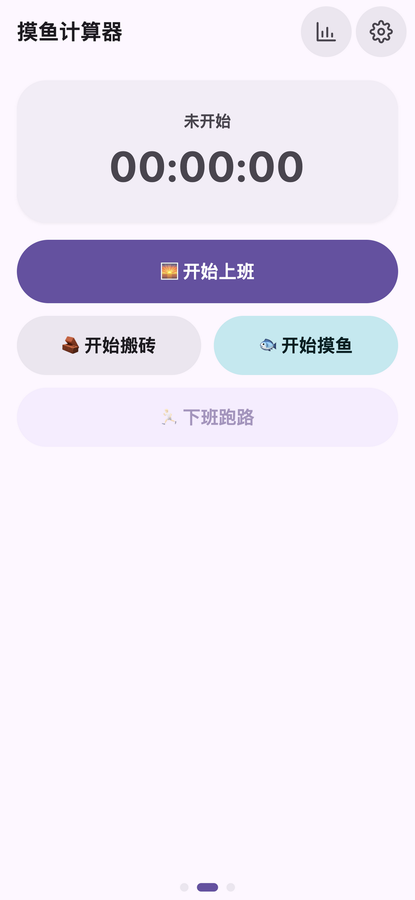
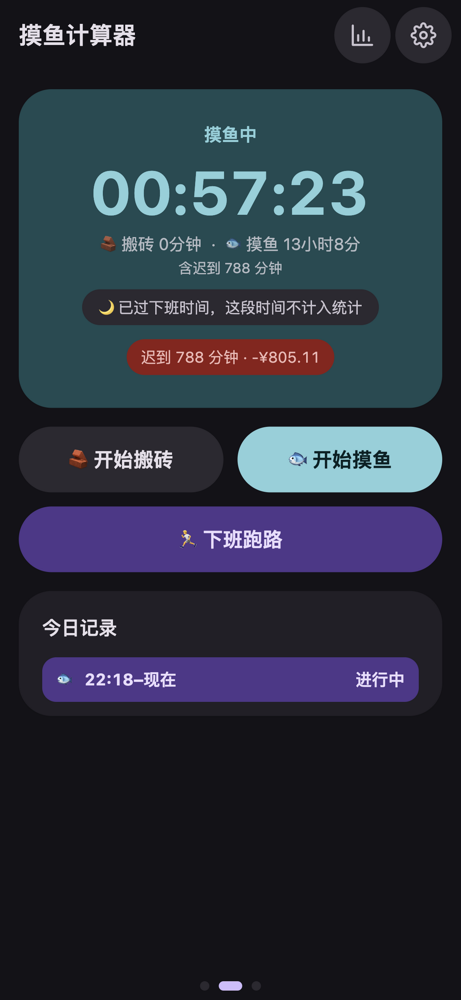
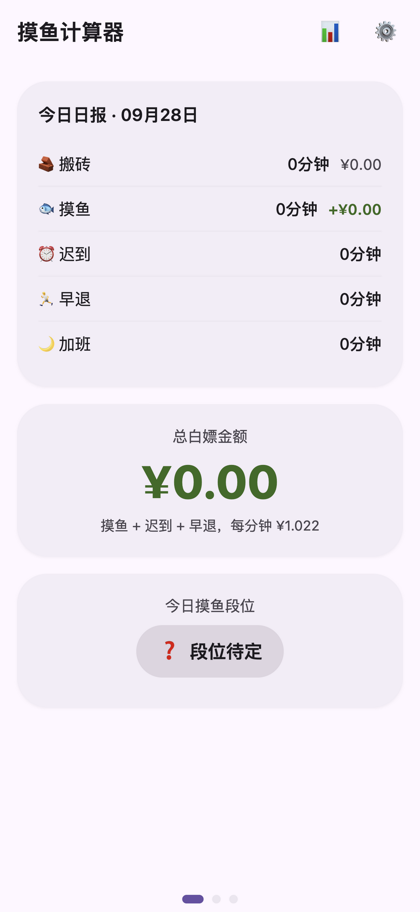
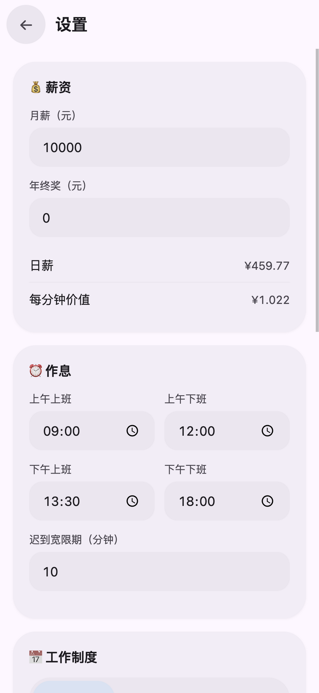
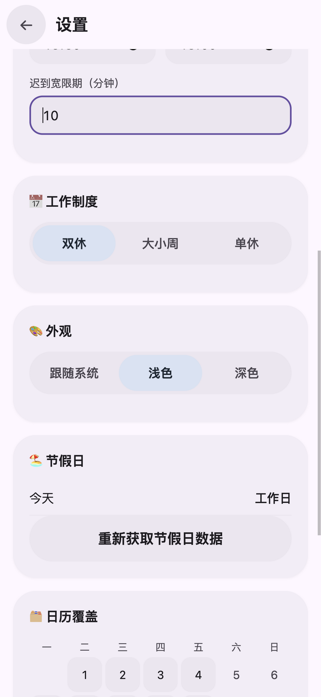
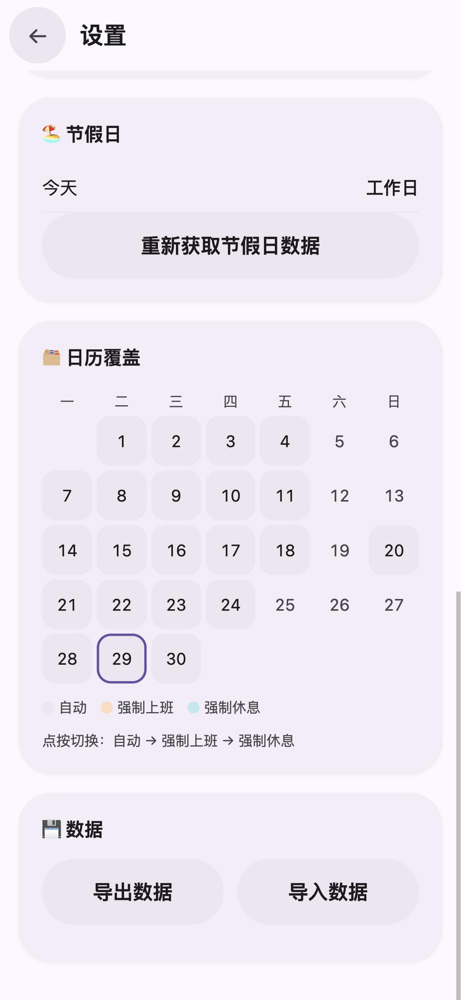

  

<h1 align="center">摸鱼计算器</h1>

算算你今天白嫖了老板多少钱 🐟

  一款移动端摸鱼记账 PWA：打卡计时、迟到早退自动判定、按你的真实薪资把每一分钟摸鱼折算成钱 
  数据全部存在手机本地，老板和网络运营商都看不到

---

## 📱 主界面

「🌅 开始上班」打卡 → 「🧱 搬砖 / 🐟 摸鱼」随意切换 → 「🏃 下班跑路」收工。大号实时计时，「今日记录」逐段记下每一次切换；浅色深色双主题， Material You 风格。

  
  

## 📊 报表

主页横向滑动三页：日报 | 主操作 | 周报。

- **日报**：今日搬砖 / 摸鱼 / 迟到 / 早退 / 加班的时长与金额，大字展示**今日总白嫖金额**和当日摸鱼段位
- **周报**：本周每天摸鱼时长柱状图（休息日斜纹、法定节假日自动识别），与上周对比箭头
- **月报**（独立页）：搬砖 vs 摸鱼环形图、累计摸鱼金额、快乐换算「本月摸鱼 ≈ X 杯奶茶」、摸鱼最多的星期几、月度段位
- 五档摸鱼段位：🥉 青铜鱼 → 🥈 白银鱼 → 🍟 老油条 → 🐋 深海巨鲸 → 🏠 公司是我家

  
  

## ⚙️ 设置（一切皆可定制，即改即存）

**💰 薪资**：填月薪和年终奖，实时算出「日薪」和「每分钟价值」——你摸的每一分钟鱼都有明码标价。
**⏰ 作息**：上午 / 下午上下班时间四段可配（午休自动剔除，不计工时也不算摸鱼），迟到宽限期可改。

  

**📅 工作制度**：双休 / 大小周 / 单休；大小周指定一个「要上班的基准周六」，之后隔周自动循环。
**🎨 外观**：跟随系统 / 浅色 / 深色。

  

**🏖️ 节假日**：自动查询当年放假调休安排并缓存本地，断网时用内置的 2026 年官方数据兜底。
**🗓️ 日历覆盖**：哪天公司临时要求加班、哪天偷偷调休，点按即可逐日切换「自动 → 强制上班 → 强制休息」，优先级高于一切自动判定。法定节假日、调休上班日在日历里一目了然（图中 9/20 就是调休上班日）。
**💾 数据**：一键导出 JSON 备份，换手机导入即恢复；本地存储，刷新、杀后台、关屏重开数据都不丢。

  

## 🐟 一些贴心的细节

- 迟到、早退的时间**自动计入摸鱼**，累计摸鱼下方会标明「含迟到 X 分钟」
- 非工作时段（上班前 / 午休 / 下班后）计时照走，但会明确提示「这段时间不计入统计」
- 忘记按「下班跑路」？当天 24:00 自动按下班时间结算，一分加班费都不会漏记
- 休息日整个操作区变成「🎉 今天放假，摸鱼自由」，不记账
- 退到后台、锁屏、被杀进程再打开，计时从上次状态无缝继续

## ⚠️ 免责声明

本应用仅供娱乐。摸鱼虽爽，请注意分寸；因使用本应用导致的任何后果（包括但不限于被老板抓包、绩效归零），作者概不负责 🐟
